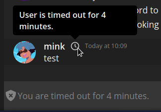

# Changelog

TODO ... this is certainly missing things

## 20230120-1: New Account Events

This update adds two new events:

- `UserPlatformWipe { user_id: String; flags: Int; }`
- `Auth { event_type: 'DeleteSession' | 'DeleteAllSessions'; [..] }` (see [Auth](/stack/bonfire/events#auth))

It also adds a new user flag of value `8` which represents a user who has been flagged and removed as spam.

It also adds one REST routes:

- `GET /users/<user_id>/flags`: Fetch user flags

If your account is disabled, login will no longer throw an error, instead it will return `Disabled { user_id: String }` with status code 200.

You must now also specify a list of reactions when enabling restrict reactions.

## 20220903-1: Changes to role colours, masquerades, members and user timeouts

Role colours now support most valid CSS gradients and colours up to 128 characters and which satisfy the following Regex:

```regex
(?i)^(?:[a-z ]+|var\(--[a-z\d-]+\)|rgba?\([\d, ]+\)|#[a-f0-9]+|(repeating-)?(linear|conic|radial)-gradient\(([a-z ]+|var\(--[a-z\d-]+\)|rgba?\([\d, ]+\)|#[a-f0-9]+|\d+deg)([ ]+(\d{1,3}%|0))?(,[ ]*([a-z ]+|var\(--[a-z\d-]+\)|rgba?\([\d, ]+\)|#[a-f0-9]+)([ ]+(\d{1,3}%|0))?)+\))$
```

You can now also masquerade role colours per-message, simply include the `colour` property matching the properties above.

All members now include a `joined_at` property which indicate when the timestamp at which they joined a certain server.

All members now also have a `timeout` property which can be changed by `PATCH /servers/<server_id>/members/<user_id>`, users will not be able to interact with the server until the time expires. A visual indicator will also display on the user's end as well as for others in chat:



## 20220901-1: Reactions Update

This update adds support for message reactions, including the following REST routes:

- `PUT /channels/<id>/messages/<id>/reactions/<emoji>`: Add reaction to message
- `DELETE /channels/<id>/messages/<id>/reactions/<emoji>`: Remove reaction from message
- `DELETE /channels/<id>/messages/<id>/reactions`: Remove all reaction from a message

It adds a new permission `React` with value `536870912`.

It adds three new events:

- `MessageReact { id: String; channel_id: String; user_id: String; emoji_id: String; }`
- `MessageUnreact { id: String; channel_id: String; user_id: String; emoji_id: String; }`
- `MessageRemoveReaction { id: String; channel_id: String; emoji_id: String; }`

## 20220707-1: Emoji Update

This update adds support for server emojis, including the following REST routes:

- `GET /custom/emoji/<id>`: Get an existing emoji
- `PUT /custom/emoji/<id>`: Create a new emoji (uses Autumn id)
- `DELETE /custom/emoji/<id>`: Delete an emoji
- `GET /server/<id>/emojis`: Fetch all emoji in a server

It adds a new permission `ManageCustomisation` with value `8`.

It includes a new field in the `Ready` payload: `emojis?: Emoji[]`.

It adds two new events:

- `EmojiCreate(Emoji)`
- `EmojiDelete { id: String }`

## 20220608-1: Friends API v2

To accomodate the new Unicode usernames, the existing add friend route is being split into two different routes:

- `PUT /users/{target}/friend`: Accept friend request where `{target}` is an ID
- `POST /users/friend`: Send friend request (with body `{ username: string }`)

The old route will stop accepting usernames in a week, see [20220608-2](/changes/20220608-friends-api-v1-deprecation).

## 20220608-2: 'Send Friend' Deprecation

The `PUT /users/{target}/friend` route will stop accepting usernames in place of `{target}`.
